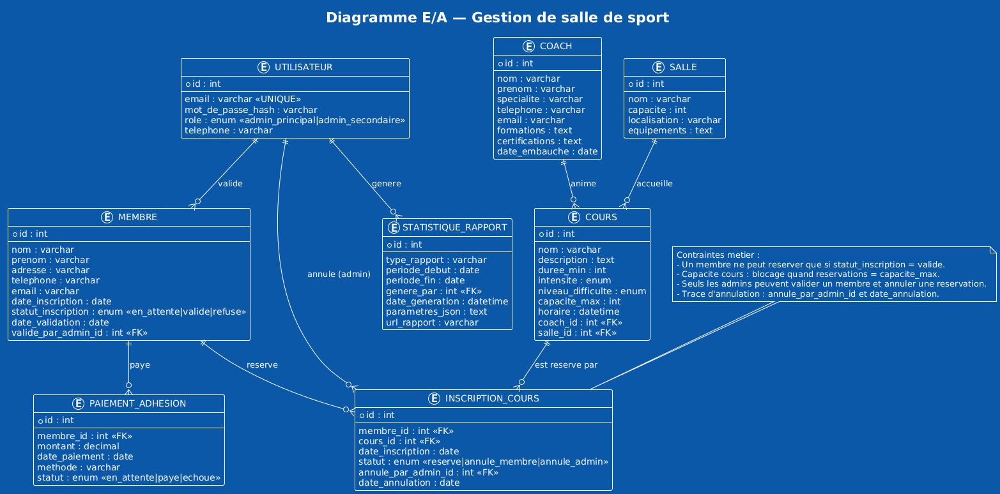

# FitNotFat - Système de gestion de salle de sport

Projet académique visant à concevoir et développer une application de gestion pour une salle de sport.

## Objectif
Mettre en place une base de données et une application permettant de gérer :
- les membres et leurs adhésions  
- les coachs  
- les cours et les réservations  
- les rôles et privilèges des utilisateurs  

## Fonctionnalités principales
- Gestion des membres, coachs et cours  
- Réservations et annulations de cours  
- Authentification sécurisée (administrateurs / membres)  
- Statistiques et rapports  

---

## Guide d'installation

> TODO

## Visualisation UML de la gestion de la BDD

